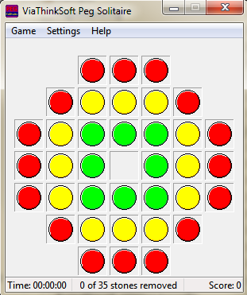
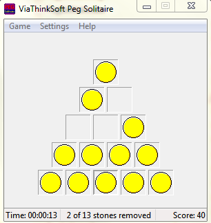
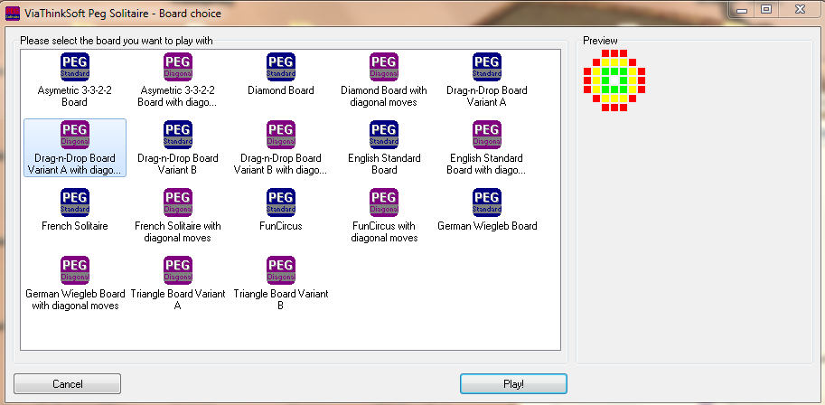

# Peg Solitaire

Peg Solitaire is a board game for one player involving movement of pegs on a board with holes. Some sets use marbles in a board with indentations. The game is known simply as Solitaire in the United Kingdom where the card games are called Patience.

More information at Wikipedia: https://en.wikipedia.org/wiki/Peg_solitaire

## Screenshots

# Tools required for editing source code

* Embarcadero Delphi 12 (Community edition available for non-commercial use)

* [Better Translation Manager](https://github.com/andersmelander/better-translation-manager/)
